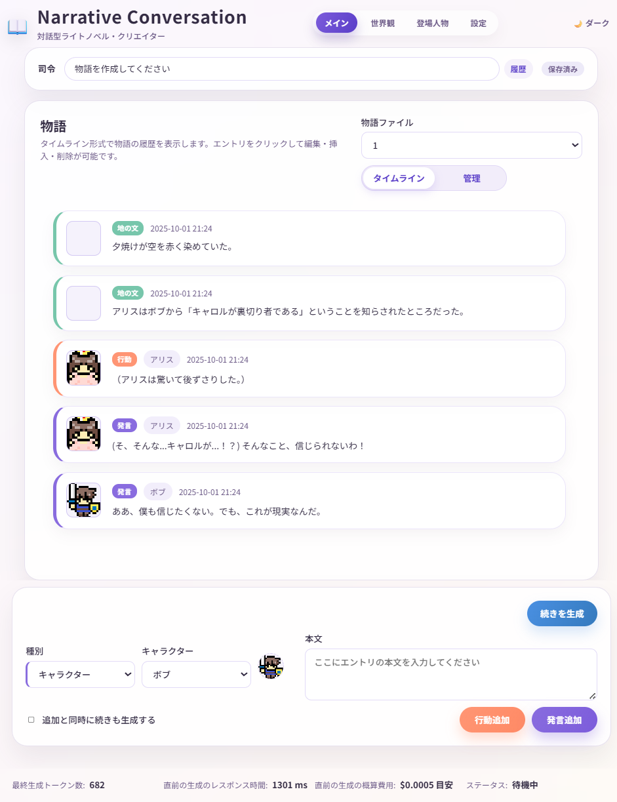

# Narrative Conversation


AIを使って、物語を作ったり、なりきって会話したり、指示出したり編集したり、ゲームブックやTRPGのように遊んだりできるアプリケーション  
通常のチャットAIでは難しい、物語の途中編集や分岐、差し替えなども簡単に行えます。  
初心者でも使いやすく、一方で上級者向けの細かいカスタマイズもできるように設計されています。

生成ボタンを連打して紡ぎ出される物語を楽しんでも良し、ナレーションをぶち込んでキャラクターを翻弄しても良し、キャラクターの一人になりきって参加しても良し、ダイスロールを回しても良し。

## [>> 説明書はこちら <<](https://gpsnmeajp.github.io/NarrativeConversationDoc/)
## [>> ダウンロード(Windows) <<](https://github.com/gpsnmeajp/NarrativeConversation/releases/)

## 一般的な注意事項
このソフトウェアはオープンソースであり、無償で提供されています。利用に際しては自己責任でお願いします。  
このソフトウェアの使用により発生したいかなる損害についても、作者は一切の責任を負いません。

**本アプリケーションでは、一般的なAIサービスのような安全機構(ガードレール)は提供されません。**

一般的なAIサービスと異なり、ユーザーが直接LLMプロバイダと契約し、APIキーを取得して料金を支払い使用する必要があります。  
そのため、APIキーの管理や使用に関する責任はユーザーにあり、また各プロバイダの利用規約を遵守する必要があります。  

また、AIが生成するコンテンツには予測不可能な情報、誤情報、有害な情報が含まれることがあります。  
生成物の著作権は利用者が全て得ることができ、一方で、生成物が意図せず著作権や商標を侵害している可能性があります。  
ユーザーは、生成されたコンテンツの内容に対して責任を負い、適切な使用を心がけてください。

**一般的なAI利用に関する留意事項は、総務省のAIリテラシー教育資料 [生成AIはじめの一歩～生成AIの入門的な使い方と注意点～](https://www.soumu.go.jp/use_the_internet_wisely/special/generativeai/) を参照してください。**

## このアプリケーションの特徴

+ 特定のAIサービスに依存せず、OpenAI互換のプロバイダやローカルで動作するLLMを利用できるため、コストを抑えつつ自由度の高い物語を作成できます。  
+ アニメーション機能など、ゲーム風の表示機能がついています。
+ 物語などはjsonl形式で保存されるため、テキストエディタで直接編集したり、配布したり、他のツールと連携したりすることが容易です。
+ XMLベースのフレームワークで、言語モデルの能力をフル活用するため、通常の対話型AIチャットよりも柔軟で強力な表現が可能です。  
+ 世界観やキャラクターを一つづつ設定できる他、発言や行動一つごとに保存・管理されるため、あとからの編集や修正、物語の分岐などの管理がとても簡単です。
+ エクスポート機能を使えば、物語を人間に読みやすいテキストや、LLMに理解しやすいXML形式で保存できます。
+ システムプロンプトを細かく設定できるため、ライトノベル風、TRPG風など、様々なスタイルで物語を楽しむことができます。
+ 世界観設定やキャラクター設定は形式指定のないテキストのため、既存のAIプロンプトをそのまま使うことも可能です。
+ 全体の方針を決めるシステムプロンプト、逐次生成方針を変更可能な「司令」、物語に入れ込める「指示」など、AIに対して多層的に指示を与えることができます。
+ 物語にJSONを埋め込んで生成させることができます。これにより、物語の進行に応じて変数を更新したり、キャラクターのステータスを管理したり、外部機器に指示を出したりできます。
+ Incoming/Outgoing Webhookを利用して、外部ツールに物語を送り出したり、逆に外部ツールから物語に介入したりできます。

## スクリーンショット


## 動作環境
+ Windows 11 (動作確認済み)
+ Ubuntu 24.04.3 LTS (動作確認済み)
+ macOS (おそらく動きますが未検証です)

## 推奨LLMプロバイダ(Base URL)
+ [OpenRouter](https://openrouter.ai/) (`https://openrouter.ai/api/v1`) (もっとも推奨, 無料枠あり)
+ LM Studio (`http://127.0.0.1:1234/v1`)
+ Ollama (`http://127.0.0.1:11434/v1`)

※ローカルLLMの場合、APIキーは適当な文字を入れてください。

その他OpenAI互換のエンドポイントを提供するLLMプロバイダであれば動作する見込みです。  
例えば

+ ~~Geminiは `https://generativelanguage.googleapis.com/v1beta/openai/`~~
+ Claudeは `https://api.anthropic.com/v1/`

など。(ただし未検証です。OpenRouterの使用を強く推奨します。)

※Gemini APIは、引数が非互換のため現在利用できません。(400エラーになる)  将来的に修正を検討します。  
( `frontend\assets\js\utils\aiGeneration.js`の`transforms: [],`をコメントアウトすることで利用できます。ただし、副作用としてOpenRouterではトークン超過警告が出ずに勝手にトークンを切り捨てるようになります。)

なお、OpenAI互換のAPIが提供されないLLMプロバイダ(例えばAmazon Bedrock等)の場合、LiteLLM ProxyのようなOpenAI互換APIを提供するプロキシを間に挟むことで動作する可能性があります。

## ビルド手順

```bash
cd backend

# Windows
python -m venv venv
venv\Scripts\Activate.ps1

# Ubuntuの場合
sudo add-apt-repository ppa:deadsnakes/ppa
sudo apt update
sudo apt install python3.11 python3.11-venv python3.11-dev
python3.11 -m venv venv
source venv/bin/activate

pip install -r requirements.txt

python run_server.py --reload
```

`http://127.0.0.1:8000` を開いてください。

## LICENSE
MIT License

本ソフトウェアおよび関連する文書のファイル（以下「ソフトウェア」）の複製を取得した全ての人物に対し、以下の条件に従うことを前提に、ソフトウェアを無制限に扱うことを無償で許可します。これには、ソフトウェアの複製を使用、複製、改変、結合、公開、頒布、再許諾、および/または販売する権利、およびソフトウェアを提供する人物に同様の行為を許可する権利が含まれますが、これらに限定されません。

上記の著作権表示および本許諾表示を、ソフトウェアの全ての複製または実質的な部分に記載するものとします。

ソフトウェアは「現状有姿」で提供され、商品性、特定目的への適合性、および権利の非侵害性に関する保証を含むがこれらに限定されず、明示的であるか黙示的であるかを問わず、いかなる種類の保証も行われません。著作者または著作権者は、契約、不法行為、またはその他の行為であるかを問わず、ソフトウェアまたはソフトウェアの使用もしくはその他に取り扱いに起因または関連して生じるいかなる請求、損害賠償、その他の責任について、一切の責任を負いません。